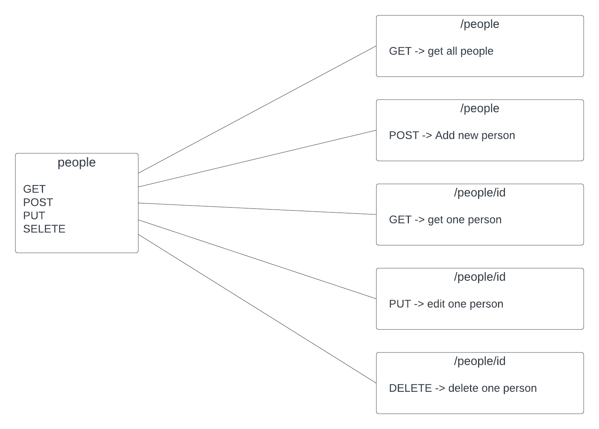

# serverless-api
 
Authors: Sham Al-Jalam, Mohammed Attallah

--- 

### URLs
deployed application : [https://zzg6rnvpf4.execute-api.us-east-1.amazonaws.com/people](https://zzg6rnvpf4.execute-api.us-east-1.amazonaws.com/people)

pull request: []()


### UML



[URL main: https://zzg6rnvpf4.execute-api.us-east-1.amazonaws.com/people](https://zzg6rnvpf4.execute-api.us-east-1.amazonaws.com/people )

methode: **/GET**
routes: /people
respons data : 
```json
[{
    "id":6,
    "name":"Ahmad",
    "age":24
}]

```
methode: **POST**
routes: /people
respons data : 
```json
{
    "id":7,
    "name":"sham",
    "age":24
}

```

methode: **Delete**
routes: /people/id
respons data : `204 No Content`

methode: **Put**
routes: /people/id
respons data : 
```json
{
    "id":7,
    "name":"sham",
    "age":30
}
```


### sceenshots


